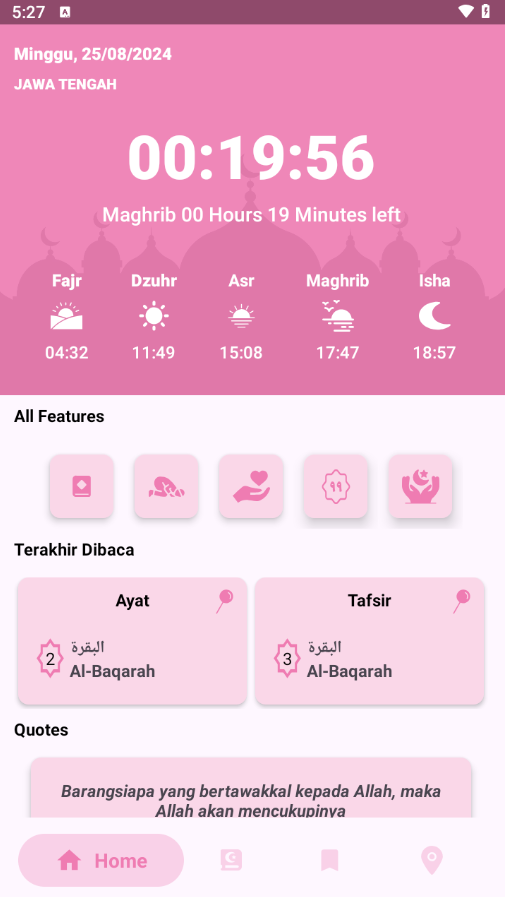
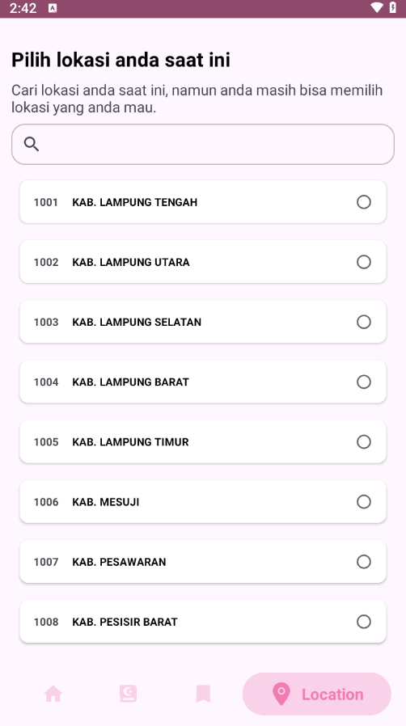
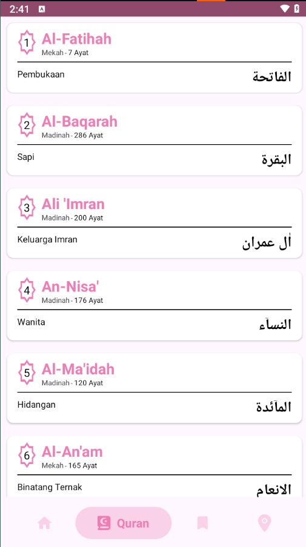
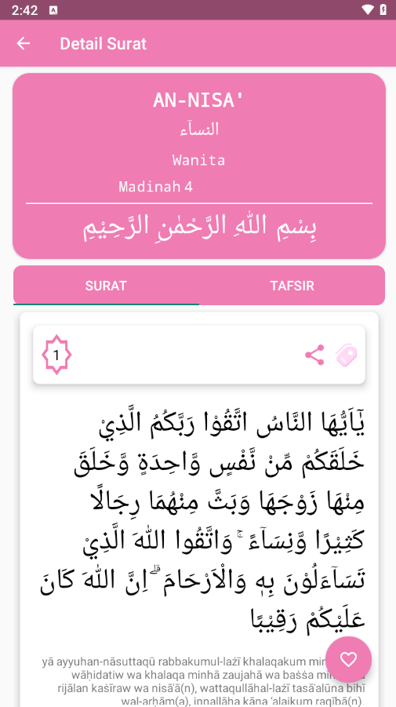
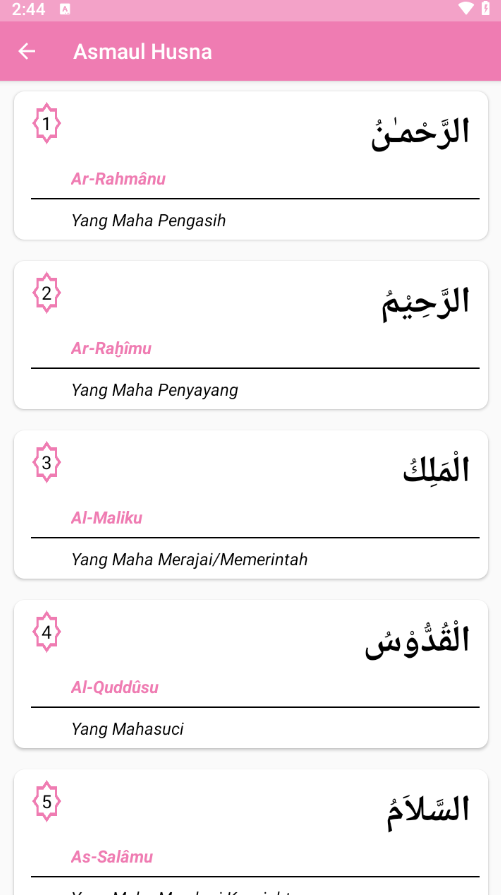

# Quranku - Al-Quran App :book:  

---

## 🌟 Features

- **Surah List & Detail View**: Explore all the Surahs with a detailed view of each Ayat.
- **Last Read Ayat**: Set and track the last Ayat you've read.
- **Share Ayat**: Share Quranic verses via WhatsApp and other platforms.
- **Asmaul Husna**: Explore the beautiful names of Allah.
- **Prayer Time**: Reminder user to pray.
- **Location**: User can choose any locations he wants.
- **Doa & Hadith**: Additional Islamic resources for prayers and Hadith.
- **Modularized Codebase**: Organized in multiple modules for better scalability and
  maintainability.

---

## 🛠️ Built With

- **Kotlin**: The primary language for Android development.
- **MVVM**: A robust architecture pattern separating UI and business logic.
- **Clean Architecture**: Ensures separation of concerns and makes testing easier.
- **Dependency Injection (Koin)**: For managing dependencies in the application.
- **Coroutines**: Handle background tasks smoothly and efficiently.
- **Modularization**: The app is divided into several modules.

---

## 📱 Screenshots

          Home Fragment | Lokasi Fragment | List Surah | Detail Surah | Asmaul Husna | Hadits Arbain
|  
|  
| 
| 
| 
| 

---

## 🚀 Free Contribution

You can join to built this app be better, dont be shy to clone this repo and contributions with
you're beautiful feature, i really happy if you guys participate for this repository.

### Prerequisites

- **Android Studio** with Flutter & Kotlin support.
- **Kotlin**: Already included with Android Studio.

